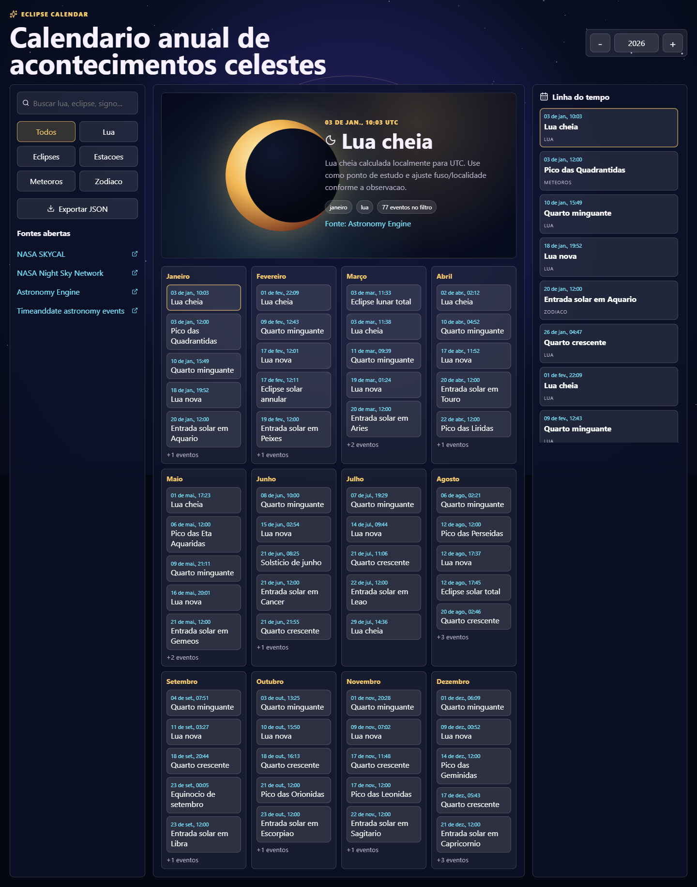

# Eclipse Calendar

Calendario anual interativo para acontecimentos celestes com leitura astronomica e camada simbolica astrologica. O antigo projeto Java/JSP foi substituido por uma aplicacao web em React + TypeScript.



## Recursos

- Fases da Lua, estacoes e eclipses calculados localmente com Astronomy Engine.
- Chuva de meteoros e marcadores zodiacais como eventos anuais de estudo.
- Filtros por tipo, busca textual, linha do tempo e painel cinematografico.
- Exportacao JSON dos eventos filtrados.
- Links para fontes gratuitas de referencia.

## Rodar localmente

```powershell
npm install
npm run dev
```

Build de producao:

```powershell
npm run build
npm run preview
```

## Fontes e criterio

- [NASA SKYCAL](https://eclipse.gsfc.nasa.gov/SKYCAL/SKYCAL.html)
- [NASA Night Sky Network](https://nightsky.jpl.nasa.gov/events/)
- [Astronomy Engine](https://github.com/cosinekitty/astronomy)
- [Timeanddate astronomy events](https://www.timeanddate.com/astronomy/sights-to-see.html)

Os horarios calculados no app usam UTC. Visibilidade de eclipses e meteoros depende de localidade, clima, horizonte e poluicao luminosa. A camada astrologica e apresentada como conteudo cultural/simbolico, nao como previsao cientifica.

